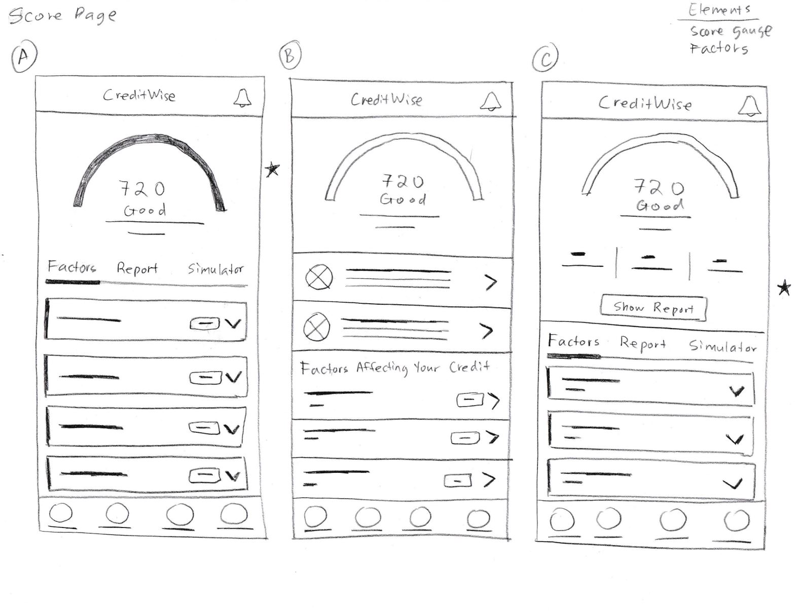
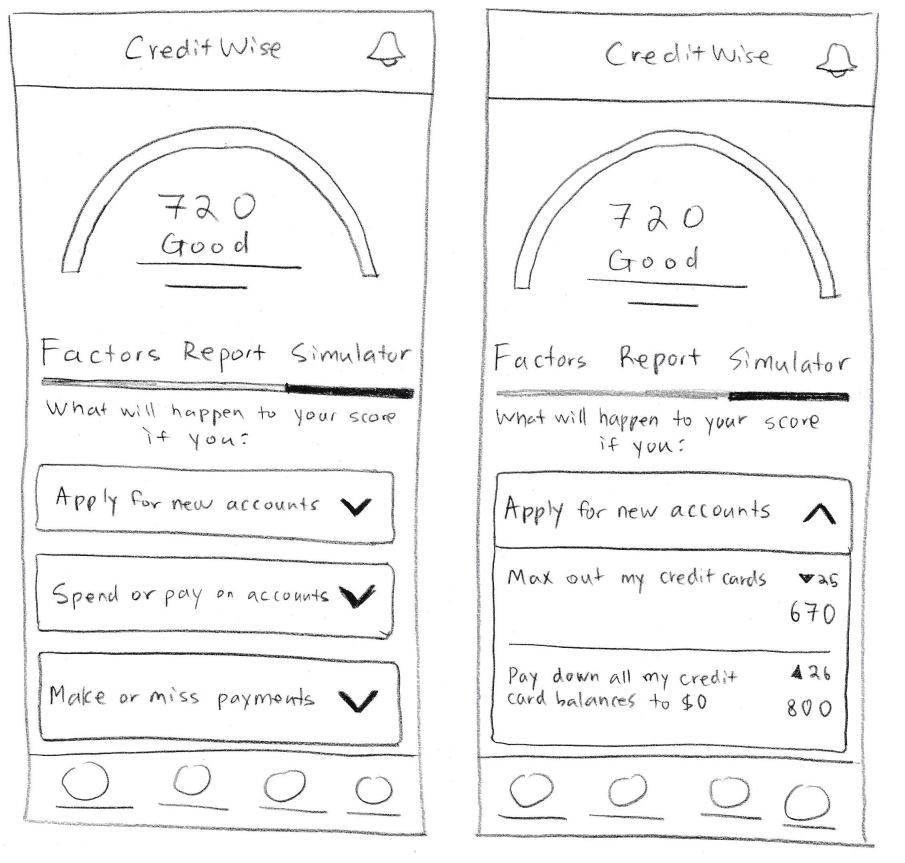

## Overview

As both the UX designer and frontend engineer, I led the project from research and discovery through wireframing, prototyping, design system creation, and Storybook component library development.

## Project Details

| Detail           | Description                                                        |
| :--------------- | :----------------------------------------------------------------- |
| **Role**         | UX Designer & UX Engineer                                          |
| **Platform**     | Mobile App                                                         |
| **Tools**        | Figma, Storybook, React                                            |
| **Deliverables** | Research, Wireframes, Prototypes, Design System, Component Library |

---

## The Problem

Many credit monitoring applications overwhelm users with financial jargon, dense datasets, and unclear guidance on how to improve their credit score. Through research, I discovered that users wanted a simpler way to understand their credit health and actionable recommendations they could follow to achieve their financial goals.

The challenge was to create an experience that transformed complex financial information into a product that felt approachable, educational, and motivating.

<!-- _\[Image: CreditWise Problem Context / App Concept Landing Area\]_ -->

---

## Research & Discovery

To better understand user needs and pain points, I conducted user interviews and analyzed existing credit monitoring applications.

### Key Findings

- **Confusing Terminology:** Users found credit terminology confusing and intimidating.
- **Data over Education:** Existing platforms often prioritized raw data over user education.
- **Actionable Guidance:** Users wanted personalized recommendations and clear next steps.
- **Motivation:** Progress tracking significantly increased motivation and engagement.

These findings helped define the product requirements and user flows.

<!-- _\[Image: Research Artifacts, Synthesis, & Affinitization\]_ -->

---

## User Personas

Based on the research, I created personas representing the primary target audience. The personas helped guide design decisions throughout the project and ensured that user needs remained at the center of the experience.

<!-- _\[Image: User Persona Examples\]_ -->

---

## User Flows

I mapped key user journeys to identify the most efficient paths through the application.

### Core Flows

1. Account onboarding
2. Viewing credit score insights
3. Setting financial goals
4. Tracking progress
5. Accessing educational content

<!-- _\[Image: Core User Flow Diagram\]_ -->

---

## Low-Fidelity Wireframes

I created low-fidelity wireframes to rapidly explore layout concepts, information hierarchy, and navigation patterns. The goal during this phase was to validate workflows before investing time in visual design.

---

## Iteration & Feedback

Following usability testing, several improvements were made to simplify navigation and improve content discoverability.

### Design Improvements

- **Simplified Dashboard:** Reorganized content layers for faster scanning.
- **Streamlined Onboarding:** Reduced friction during the signup and identity check steps.
- **Prominent Indicators:** Emphasized progress trackers and score goal milestones.
- **Reduced Cognitive Load:** Grouped relevant data chunks and added plain-language explanations.

<!-- _\[Image: Before & After Design Evolution\]_ -->

---

## High-Fidelity Mockups

Once the wireframes were validated, I designed high-fidelity mockups in Figma. The visual design focused on:

- **Accessibility:** Accessible color contrast ratios matching WCAG criteria.
- **Clear Visual Hierarchy:** High typographic contrast and emphasis on key status updates.
- **Financial Trust & Credibility:** Clean layouts, professional color choices, and secure messaging indicators.
- **Mobile-First Responsiveness:** Strict adherence to screen layout bounds and component padding.
- **Consistent Design Patterns:** Universal iconography and visual element repetition.

<!-- _\[Image: Final High-Fidelity App Designs Showcase\]_ -->

---

## Interactive Prototype

I developed an interactive prototype in Figma to simulate the complete user experience and validate interactions before development.

### Prototype Features

- Smooth transition onboarding flows
- Dynamic dashboard interactions
- Step-by-step goal creation workflows
- Real-time progress tracking visualization
- Micro-interactions and layout transitions

<!-- _\[Image: Interactive Prototype Showcase / Video Capture Placeholder\]_ -->

---

## Design System

To maintain consistency across the application, I created a scalable design system consisting of:

- **Color Tokens:** Brand colors, functional alert semantics, and system grays.
- **Typography Scales:** Strictly mapped headings, body texts, and small caption styles.
- **Spacing Rules:** Consistent grid system increments (e.g., 8pt grid).
- **Grid Systems:** Adaptive layouts fitted cleanly to mobile screen edges.
- **Reusable UI Patterns:** Reusable headers, footers, containers, and visual styles.
- **Interaction States:** Defined default, hover, active, focused, and disabled looks.

<!-- _\[Image: Design System Tokens & Asset Library Overview\]_ -->

---

## Storybook Component Library

To bridge the gap between design and development, I translated the design system into a reusable Storybook component library. Components were documented, tested, and displayed in isolation to support scalability and consistency.

### Components Included

- **Buttons:** Primary, secondary, icon variants, and status states.
- **Form Inputs:** text boxes, validation layouts, and verification prompts.
- **Credit Score Cards:** Main arc dashboard component displaying scores and updates.
- **Progress Indicators:** Linear bar metrics and tracking ring assets.
- **Navigation Components:** Bottom tab bars and contextual navigation headers.
- **Educational Content Cards:** Grid blocks holding bite-sized credit explanations.

<!-- _\[Image: Storybook Architecture & Component Showcase Dashboard\]_ -->

[View StoryBook Component Library](https://credit-wise-mobile-app.vercel.app/?path=/docs/components-alert--docs)

---

## Outcome

CreditWise demonstrates my ability to take a product from initial research through design system development and frontend implementation planning. By combining UX methodologies with engineering principles, I created a scalable, user-centered experience that helps users better understand and improve their credit health.

<!-- _\[Image: Final Finished Product Mockup\]_ -->

---

## Key Takeaways

- Conducted user research and competitive analysis.
- Created user personas and target user flows.
- Designed modular low and high-fidelity wireframes.
- Built full interactive prototypes in Figma.
- Developed a scalable design token framework.
- Implemented a clean Storybook component library.
- Applied structural UX Engineering principles to tightly bridge design and development.

---

## Tools & Methods

### Design

- Figma
- Design Systems
- Wireframing
- Prototyping

### Research

- User Interviews
- Competitive Analysis
- User Personas
- Usability Testing

### Development

- React
- Storybook
- Component Libraries
- Accessibility (WCAG)
